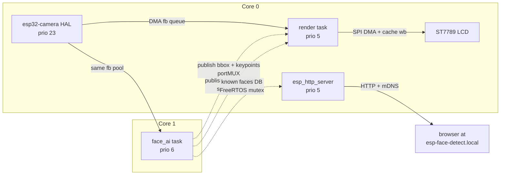
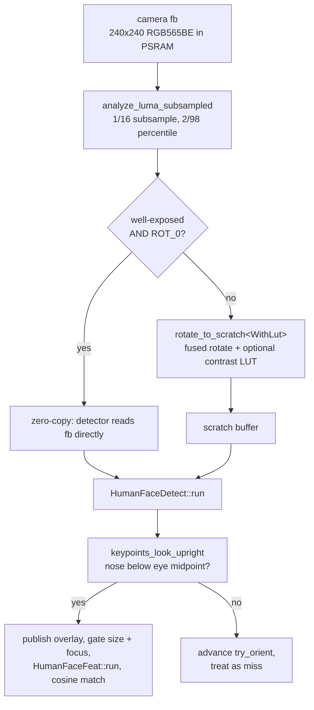

# esp32_s3_eye_demo

A face detection, recognition, and remembering demo for the
[**ESP32-S3-EYE**](https://www.espressif.com/en/products/devkits/esp32-s3-eye)
dev board. Live camera preview on the on-board LCD, on-device neural-network
inference, an overlay HUD with bbox + facial keypoints, an "I will remember
you" banner whenever a new face is enrolled, and a tiny mDNS-discoverable
web UI for browsing and naming everyone the camera has seen since boot.

Built with PlatformIO + ESP-IDF and the
[ESP-WHO](https://github.com/espressif/esp-who) face stack (MSR+MNP
detector, MobileFaceNet embedder), running entirely on the S3's two
Xtensa LX7 cores — no cloud, no companion app, no off-device inference.

---

## Features

- **Live preview** of the OV2640 camera on the 240×240 ST7789 LCD at the
  sensor's full output rate.
- **Face detection** that auto-cycles through 0 / 90 / 180 / 270° input
  rotations so the device works whether you're holding it portrait,
  landscape, or upside down.
- **Detection HUD** drawn on top of the live preview: green bbox plus
  five color-coded keypoint dots (red = L eye, yellow = R eye, lime =
  nose, magenta = L mouth corner, cyan = R mouth corner) — same look as
  the stock Espressif demo, persists smoothly through brief detector
  misses.
- **Per-frame contrast pre-processing** (sub-sampled luma histogram → 2/98
  percentile linear stretch, applied in a fused single-pass kernel) so
  the detector still works in dim or low-contrast indoor lighting.
- **Face recognition** using MobileFaceNet embeddings + cosine similarity
  (SIMD-accelerated via ESP-DSP's `dsps_dotprod_f32` PIE assembly).
- **Enrollment banner** — "NEW FACE / DETECTED" composited onto the live
  preview, with the text orientation locked at enrollment to whichever
  way the face was actually facing.
- **mDNS-discoverable web UI** at `http://esp-face-detect.local/` —
  shows every enrolled face's thumbnail, lets you name them, polls for
  new enrollments.

---

## Hardware

| Component | Notes |
|---|---|
| **ESP32-S3-EYE** (rev 2.1+) | OV2640 camera, ST7789 LCD, 8 MB octal PSRAM, 8 MB flash |
| **5 V USB-C supply** | Decent supply — face inference + camera + LCD draw ~300 mA bursts |

Tested on the v2.1 board. Nothing in the code is fundamentally
S3-EYE-specific — the pin map lives in [`src/board_pins.h`](src/board_pins.h)
and the camera config in [`src/camera.cpp`](src/camera.cpp). Porting
to another OV2640 + ST7789 board mostly means editing those two files.

---

## Build & flash

### Prerequisites

- [PlatformIO Core](https://platformio.org/install/cli) (the VS Code
  extension also works)
- Python 3.10+ on `PATH` (only used by the helper script that packs the
  ESP-DL model partitions)

### One-time setup

```pwsh
git clone https://github.com/haywoodsloan/esp32_s3_eye_demo
cd esp32_s3_eye_demo

# Copy and edit the credentials template with your network's SSID / password.
copy src\wifi_credentials.h.example src\wifi_credentials.h
notepad src\wifi_credentials.h
```

### Build, flash, monitor

```pwsh
pio run                 # build app + bootloader + partition table
pio run -t upload       # also packs and flashes the ESP-DL model partitions
pio device monitor      # 115200 baud
```

The face-detect and face-feat ESP-DL models live in their own flash
partitions (see the [partition table](#partition-layout) below) and are
packed + uploaded by [`scripts/flash_espdl_models.py`](scripts/flash_espdl_models.py),
which PlatformIO invokes via the `pre:` extra script hook in
[`platformio.ini`](platformio.ini). This works around an
[upstream esp-dl bug](#workarounds) with PlatformIO's relative `BUILD_DIR`.

### Web UI

Once the device logs `got IP: ...` and `mDNS up: http://esp-face-detect.local/`,
open that URL in any browser on the same Wi-Fi network. mDNS resolution
works on macOS, iOS, modern Windows (≥ 10 1803), Linux with `avahi`, and
Android 12+. If your client doesn't speak mDNS, use the IP from the
serial log directly.

The page polls `/api/faces` every 2 s and renders one card per enrolled
face — thumbnail, an editable name input, and a Save button. Names are
stored in RAM and reset on every boot (persistence is a planned future
feature).

---

## Architecture

The board's two cores are deliberately load-balanced:

- **Core 0** runs the camera HAL (`cam_hal`, prio 23) and the LCD render
  task (prio 5). Both are short, bursty consumers that share a core
  comfortably.
- **Core 1** is reserved for the face-AI task (prio 6). Inference is ~50–100 ms
  per detection-frame, so giving it a dedicated core lets the live preview
  hit the camera's full output rate without the AI loop starving it.



### Per-frame detection pipeline

The detector input goes through a fused pipeline rather than a chain of
separate passes:



The "well-exposed ROT_0" fast path is the common runtime case (user
sitting normally in good light) and pays only the 1/16-sample histogram
cost; everything else still resolves to a single PSRAM pass.

### Cross-task synchronisation

| Shared resource | Mechanism | Hold time |
|---|---|---|
| `g_banner_until_ms` | `std::atomic<uint32_t>` | n/a (lock-free, 32-bit s32c1i) |
| `g_overlay` (bbox + keypoints) | `portMUX_TYPE` spinlock | nanoseconds (memcpy POD) |
| `g_known_faces` (face DB) | FreeRTOS mutex | up to ~30 µs (matcher loop), webserver only takes it for the snapshot copy |

---

## Partition layout

| Name | Offset | Size | Use |
|---|---|---|---|
| `nvs` | `0x9000` | 24 KB | Wi-Fi calibration + ESP-IDF housekeeping |
| `phy_init` | `0xf000` | 4 KB | radio calibration |
| `factory` (app) | `0x10000` | **4 MB** | firmware |
| `human_face_det` | `0x410000` | 256 KB | packed MSR+MNP detector (~190 KB) |
| `human_face_feat` | `0x450000` | 1.5 MB | packed MobileFaceNet embedder (~1.3 MB) |
| `storage` (SPIFFS) | `0x5D0000` | 512 KB | SPIFFS scratch (wiped each boot) |

The two ESP-DL model partitions must be named **exactly** `human_face_det`
and `human_face_feat` — the upstream ESP-DL CMake hardcodes those names.
See [`partitions.csv`](partitions.csv).

---

## Tunable knobs

Most behaviour is one constant away from being adjusted. The interesting
ones, with the values used at HEAD:

### Face AI ([`src/face_ai.cpp`](src/face_ai.cpp))

| Knob | Value | Effect |
|---|---|---|
| `MIN_FACE_PX` | 83 | Reject detections smaller than this; bigger → user must stand closer |
| `MIN_SHARPNESS` | 25 | Focus-metric floor (avg `\|dG/dx\| + \|dG/dy\|`) |
| `MATCH_THR` | 0.40 | Cosine-sim threshold for "known"; lower → more recognitions, more false positives |
| `ENROLL_DEBOUNCE_FRAMES` | 2 | Consecutive sharp-unknown frames before enrolling |
| `MAX_KNOWN_FACES` | 32 | Per-boot DB cap |
| `BANNER_HOLD_MS` | 5000 | Banner duration |
| `ORIENT_STICKY_MISSES` | 2 | Detection-misses on locked orient before cycling resumes |
| `OVERLAY_CLEAR_MISSES` | 8 | Detection-misses before the on-screen HUD hides itself |
| `PREP_STRIDE` | 4 | Histogram subsample stride (1/16 of pixels touched) |
| `STRETCH_RANGE_MAX` | 200 | Skip contrast stretch when 2/98-percentile spread already ≥ this |

### Overlay rendering ([`src/main.cpp`](src/main.cpp))

| Knob | Value | Effect |
|---|---|---|
| `OVERLAY_DOT_COLORS[5]` | red/yellow/lime/magenta/cyan | Per-keypoint dot colors (BE RGB565) |
| `OVERLAY_BOX_THICKNESS` | 2 | Bbox stroke width in pixels |
| `OVERLAY_DOT_RADIUS` | 3 | Keypoint dot radius in pixels |
| `OVERLAY_FRESH_MS` | 2000 | Render-side staleness safety net |

### Banner ([`src/banner.cpp`](src/banner.cpp))

| Knob | Value | Effect |
|---|---|---|
| `SCALE` | 2.55 | Font size (source pixel → destination pixel) |
| `DOT_RADIUS_PX` | 2.1 | Anti-aliasing soft-dot radius |
| `OUTLINE_RADIUS_PX` | 2 | Black outline halo around the green text |
| `LINE_OFFSET_PX` | 84 | Distance from buffer centre to each line's centre |

---

## Project layout

```
src/
├── main.cpp                    app_main, render task, overlay drawing
├── camera.cpp / .h             OV2640 init (RGB565, 240x240, double-buffered PSRAM)
├── display.cpp / .h            ST7789 SPI bring-up, DMA flush, backlight
├── banner.cpp / .h             "NEW FACE DETECTED" overlay compositor
├── face_ai.cpp / .h            detection + recognition task, fused preprocessing pipeline, public face-DB API
├── wifi.cpp / .h               station-mode Wi-Fi bring-up
├── wifi_credentials.h          (gitignored) WIFI_SSID / WIFI_PASSWORD
├── wifi_credentials.h.example  template for the above
├── webserver.cpp / .h          esp_http_server endpoints + embedded HTML + mDNS
├── board_pins.h                pin map for the S3-EYE
├── idf_component.yml           ESP-IDF managed-component dependencies
└── CMakeLists.txt
scripts/
└── flash_espdl_models.py       packs + appends model partitions to FLASH_EXTRA_IMAGES
partitions.csv                  see partition layout above
platformio.ini                  PIO env config, extra_script hook
sdkconfig.defaults              key ESP-IDF knobs (PSRAM, exception support, brownout, etc.)
```

---

## API surface

### HTTP

| Method | Path | Body / response |
|---|---|---|
| `GET` | `/` | Embedded HTML page (single-file, vanilla JS) |
| `GET` | `/api/faces` | `[{ "id": int, "name": string, "enrolled_ms": uint }, …]` |
| `GET` | `/api/face/<id>/thumb` | 24-bit BMP, 64×64, content-type `image/bmp` |
| `POST` | `/api/face/<id>/name` | Request body is the literal name string; responds `{"ok":true}` |

### C++ (in-process)

```cpp
// face_ai.h
esp_err_t face_ai_init();
bool      face_ai_banner_active();
void      face_ai_get_overlay(face_overlay_t *out);

int       face_db_count();
bool      face_db_get_entry(int idx, face_db_entry_t *out);
bool      face_db_copy_thumb(int idx, uint16_t *dst, size_t capacity_px);
bool      face_db_set_name(int idx, const char *name);
```

---

## Performance characteristics

On an ESP32-S3 @ 240 MHz / 8 MB octal PSRAM @ 80 MHz, with both ESP-DL
model partitions resident in flash:

- **Render loop:** sensor-rate (≈ 25–30 FPS) — bottlenecked by the camera
  HAL, not the LCD.
- **Detector cycle:** ~60–100 ms per attempt (MSR + MNP cascade). Locked
  orient → that's the steady-state rate; cycling through all four
  orientations is the cold-start worst case (~300–400 ms).
- **Embedder:** ~50 ms per call (MobileFaceNet S8). Only runs on
  sharp + correctly-sized detections.
- **Preprocessing overhead:** ~0.5 ms (subsampled histogram + zero-copy)
  in the common case, ~3 ms (one PSRAM rotate-and-stretch pass) when a
  stretch is needed.
- **Cosine match:** SIMD dot product → tens of microseconds for the full
  32-face DB sweep.

---

## Workarounds

A few non-obvious things this codebase has to do; documented here so
they don't get re-discovered the hard way.

1. **`-fuse-cxa-atexit` leaks into C compiles** when `CONFIG_COMPILER_CXX_EXCEPTIONS=y`
   (needed by ESP-DL), causing `-Werror` builds to fail. Worked around
   with `build_unflags = -fuse-cxa-atexit` in [`platformio.ini`](platformio.ini).

2. **ESP-DL `_IN_FLASH_RODATA` mode has a doubled-path bug under PlatformIO**:
   `idf_build_get_property(BUILD_DIR)` returns a relative path under PIO,
   which CMake then re-resolves against `CMAKE_CURRENT_BINARY_DIR`. We
   sidestep it entirely by using `_IN_FLASH_PARTITION` and dedicated
   model partitions.

3. **PIO doesn't pack or auto-flash extra ESP-DL partitions** — the
   upstream esp-dl model packing is hooked into CMake (`add_custom_target ALL`
   + `add_dependencies(flash …)`), which SCons-driven PIO never invokes.
   [`scripts/flash_espdl_models.py`](scripts/flash_espdl_models.py) runs as
   a `pre:` extra script, packs the `.espdl` blobs, and appends them to
   `FLASH_EXTRA_IMAGES` so PIO's espressif32 platform picks them up.

4. **Brownout detector lowered** from the IDF default `SEL_7` (~3.19 V)
   to `SEL_4` so transient peak-current dips on USB power don't reset
   the device when camera + LCD + ESP-DL all peak together.

5. **Detector occasionally fires on upside-down faces** (rough top/bottom
   symmetry of facial features). Guarded by `keypoints_look_upright()`
   — rejects any detection where the nose is at or above the eye midpoint
   in the *detector's input frame*.

---

## Not yet implemented

- **Persistence**: faces and names reset on every boot. SPIFFS partition
  is already mounted (and currently unused — we wipe it at startup).
- **HTTPS / auth**: the HTTP server is plaintext and unauthenticated.
  Fine on a trusted LAN; don't expose to the internet.
- **OTA updates**: only `factory`-partition flashing is set up.
- **Multiple-face attention**: only the largest bbox per frame is matched
  + enrolled, by design.

---

## Acknowledgements

- [Espressif ESP-WHO](https://github.com/espressif/esp-who) for the
  HumanFaceDetect (MSR+MNP) and HumanFaceFeat (MobileFaceNet) models.
- [ESP-DSP](https://github.com/espressif/esp-dsp) for the LX7 PIE-SIMD
  kernels.
- [esp32-camera](https://github.com/espressif/esp32-camera) for the
  OV2640 HAL.
- [PlatformIO](https://platformio.org/) for the build orchestration.
