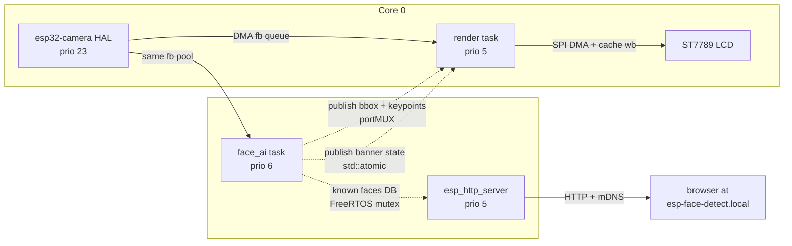
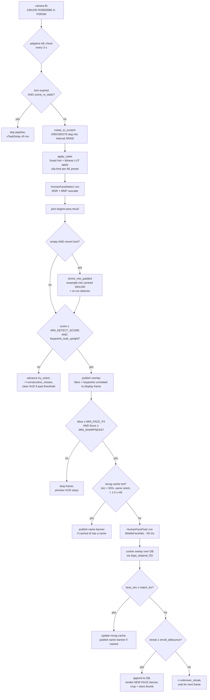

# esp32_s3_eye_demo

A face-detection, face-recognition, and face-remembering demo for the
[**ESP32-S3-EYE**](https://www.espressif.com/en/products/devkits/esp32-s3-eye)
dev board. Live camera preview on the on-board LCD, on-device neural-network
inference, an overlay HUD with bbox + facial keypoints, a "NEW FACE
DETECTED" banner whenever a face is enrolled, a navy name banner whenever
a known face is recognised, and an mDNS-discoverable web UI for browsing,
naming, and deleting everyone the camera has seen since boot.

Built with PlatformIO + ESP-IDF on top of the
[ESP-WHO](https://github.com/espressif/esp-who) face stack (MSR + MNP
detector, MobileFaceNet embedder). Everything runs on the S3's two
Xtensa LX7 cores — no cloud, no companion app, no off-device inference.

---

## Features

- **Live preview** of the OV2640 camera on the 240×240 ST7789 LCD at the
  sensor's full output rate.
- **Rotation-invariant detection**: the AI loop auto-cycles through
  0 / 90 / 180 / 270° input rotations, so the device works whether
  you're holding it portrait, landscape, or upside down. Once an
  orientation locks, subsequent frames re-use it for single-shot
  detection.
- **Detection HUD** drawn on top of the live preview: green bbox plus
  five colour-coded keypoint dots (red = left eye, yellow = right eye,
  lime = nose, magenta = left mouth corner, cyan = right mouth corner).
  The HUD persists smoothly through brief detector misses and only
  hides itself when the face has clearly left the frame.
- **Adaptive image-processing pipeline** — the full detector input goes
  through pre-rotation → CLAHE contrast-limited histogram equalisation
  (single-pass, fused with the histogram build) → MSR + MNP detection
  → a close-range padded-fallback retry → geometry / size / sharpness
  gates → recognition-cache short-circuit → MobileFaceNet embedding
  → cosine-similarity match. See [Image processing
  pipeline](#image-processing-pipeline) for the full walkthrough.
- **Adaptive AE bias** drives the OV2640's gain ceiling, brightness, and
  AE target off the frame's mean luma, picking between three presets
  (DIM / MID / BRIGHT) with asymmetric hysteresis. The same preset cycle
  also pulls the matcher's similarity threshold and the CLAHE clip-limit
  with it, so each lighting regime uses thresholds tuned to its own
  signal-to-noise profile.
- **Motion pre-screen** — a coarse 8×8 luma-sample-grid SAD test that
  skips the entire detection pipeline when the scene hasn't moved and
  no face is currently locked. Saves roughly 80–160 ms of CPU per cycle
  whenever the room is empty.
- **Face recognition** via MobileFaceNet embeddings + cosine similarity
  (SIMD-accelerated by ESP-DSP's `dsps_dotprod_f32` PIE assembly). An
  IoU-keyed recognition cache short-circuits the ~50 ms embedder pass
  while the same face stays in roughly the same position.
- **Enrolment banner** — "NEW FACE / DETECTED" composited onto the live
  preview in dark green with a black outline. Rendered from a real
  bitmap font (FreeSans 18pt) in Adafruit GFXfont format, and rotated
  to match the head pose at the moment of enrolment.
- **Recognition banner** — navy-blue name overlay along the bottom edge
  of the live preview whenever the matcher returns a face that has been
  named in the web UI. Shares the font + outline pipeline with the
  green banner; rotates to match the head pose.
- **mDNS-discoverable web UI** at `http://esp-face-detect.local/` — grid
  of enrolled faces with thumbnails, editable names, and delete
  buttons. Renaming a face updates both the on-screen card and the
  on-LCD navy banner the moment the matcher next hits it.

---

## Hardware

| Component | Notes |
|---|---|
| **ESP32-S3-EYE** (rev 2.1+) | OV2640 camera, ST7789 LCD, 8 MB octal PSRAM, 8 MB flash |
| **5 V USB-C supply** | Use a decent cable / port — camera + LCD + ESP-DL inference can hit ~300 mA peaks together |

Tested on the v2.1 board. Nothing in the code is fundamentally
S3-EYE-specific — porting to another OV2640 + ST7789 setup is mostly
a matter of editing [`src/board_pins.h`](src/board_pins.h) (pin map)
and [`src/camera.cpp`](src/camera.cpp) (sensor config).

---

## Build & flash

### Prerequisites

- [PlatformIO Core](https://platformio.org/install/cli) — the VS Code
  extension works too.
- Python 3.10+ on `PATH`. Used by two `pre:` extra scripts:
  - [`scripts/embed_web_html.py`](scripts/embed_web_html.py) bakes
    [`src/web/index.html`](src/web/index.html) into a C++ raw-string
    header that the firmware serves over HTTP.
  - [`scripts/flash_espdl_models.py`](scripts/flash_espdl_models.py)
    packs the ESP-DL model blobs and appends them to PlatformIO's
    `FLASH_EXTRA_IMAGES` so they land in their own flash partitions
    on every `pio run -t upload`.

### One-time setup

```pwsh
git clone https://github.com/haywoodsloan/esp32_s3_eye_demo
cd esp32_s3_eye_demo

# Copy and edit the credentials template with your network's SSID / password.
copy src\wifi_credentials.h.example src\wifi_credentials.h
notepad src\wifi_credentials.h
```

### Build, flash, monitor

```pwsh
pio run                 # build app + bootloader + partition table
pio run -t upload       # also packs and flashes the ESP-DL model partitions
pio device monitor      # 115200 baud
```

The two ESP-DL model partitions (`human_face_det`, `human_face_feat`)
are packed and uploaded by
[`scripts/flash_espdl_models.py`](scripts/flash_espdl_models.py), which
PlatformIO invokes as a `pre:` extra script (see
[`platformio.ini`](platformio.ini)). This works around the
[upstream esp-dl bug](#workarounds) with PlatformIO's relative
`BUILD_DIR`.
### Web UI

Once the device logs `got IP: ...` and `mDNS up: http://esp-face-detect.local/`,
open that URL in any browser on the same Wi-Fi network. mDNS resolution
works on macOS, iOS, modern Windows (≥ 10 1803), Linux with `avahi`, and
Android 12+. If your client doesn't speak mDNS, use the IP from the
serial log directly.

The page polls `/api/faces` every 2 s and renders one card per enrolled
face — thumbnail, name input + Save, and a Delete button. Names live
in RAM and reset on every boot ([persistence](#not-yet-implemented) is
still on the to-do list).

---

## Architecture

The board's two cores are deliberately load-balanced:

- **Core 0** runs the camera HAL (`cam_hal`, prio 23) and the LCD render
  task (prio 5). Both are short, bursty consumers that share a core
  comfortably (both are mostly DMA-wait-bound).
- **Core 1** is reserved for the face-AI task (prio 6) and the HTTP
  server task (also prio 5). Inference is ~50–100 ms per detection-frame
  on the AI task; giving it a dedicated core lets the live preview hit
  the camera's full output rate without the AI loop starving it. The
  HTTP server is pinned alongside it because face_ai sleeps between
  misses and HTTP requests are infrequent — they slot into those gaps
  cleanly without perturbing the preview path on core 0.



### Cross-task synchronisation

| Shared resource | Mechanism | Hold time |
|---|---|---|
| `g_banner_until_ms`, `g_name_banner_until_ms` | `std::atomic<uint32_t>` | n/a (lock-free, 32-bit `s32c1i`) |
| `g_last_mean_luma` | `std::atomic<int>` | n/a (same-task read/write) |
| `g_overlay` (bbox + keypoints) | `portMUX_TYPE` spinlock | nanoseconds (memcpy POD) |
| `g_known_faces` (face DB) | FreeRTOS mutex via `FaceDbLock` RAII guard | up to ~30 µs (matcher loop); webserver only takes it for the snapshot copy |

`uint32_t` ms-since-boot rather than `int64_t` µs because the Xtensa
LX7 has lock-free 32-bit atomics (`s32c1i`) but no native 8-byte CAS —
`std::atomic<int64_t>` lowers to libatomic mutex calls.

---

## Image processing pipeline

This is the full per-frame walk through the face-AI task, from the
camera framebuffer arriving on `xQueueReceive` to a recognition or
enrolment landing in the database. Everything below happens inside
`face_ai_task()` in [`src/face_ai.cpp`](src/face_ai.cpp); the file is
heavily commented and the source is the canonical reference.



Stage by stage:

### 1. Adaptive AE check (every ~3 s)

The face_ai loop reads `g_last_mean_luma` (an atomic int written by
the CLAHE pass — see stage 3) and decides whether to transition the
OV2640 between three AE presets: **DIM**, **MID**, **BRIGHT**.

| Preset | gain ceiling | ae_level | brightness | Trigger to enter | Trigger to leave |
|---|---|---|---|---|---|
| DIM | 128× | +2 | +2 | luma < 85 | luma > 120 |
| MID | 32× | +1 | +1 | (start state, or from neighbour) | luma < 85 / > 185 |
| BRIGHT | 4× | -1 | -1 | luma > 185 | luma < 150 |

Hysteresis bands are asymmetric on purpose — the threshold to *enter*
a preset is further from the centre than the threshold to *leave* it,
so a scene hovering at a boundary doesn't flap between presets every
check. Each transition costs a few SCCB writes plus 100-200 ms of AE
settle in the sensor.

The preset also drives a parallel `Tuning` struct used elsewhere in
the pipeline:

| Field | DIM | MID | BRIGHT | Effect |
|---|---|---|---|---|
| `match_thr` | 0.32 | 0.38 | 0.45 | Cosine-sim floor for "known face". Loosened in DIM where noise drags same-person sims down; tightened in BRIGHT where the cleaner signal lets us be stricter without losing recognitions. |
| `enroll_debounce` | 2 | 1 | 1 | Frames-in-a-row of "unknown" required before a new enrolment commits. DIM needs the extra frame because high-gain noise can fake a single-frame "unknown" for a known person. |
| `clahe_clip_lim` | 252 (7 %) | 180 (5 %) | 72 (2 %) | Per-tile histogram clip-limit. Aggressive in DIM (dark scenes need the contrast lift even at the cost of some noise), moderate in MID, and very gentle in BRIGHT (just enough to recover backlit / washed-out faces without amplifying sensor noise in already-flat highlights). |

### 2. Motion pre-screen

Once `consecutive_misses` has crossed `OVERLAY_CLEAR_MISSES` (the
threshold past which the on-screen HUD has already hidden itself
because the face is clearly gone), the loop checks whether the scene
has actually changed before running anything expensive.

`scene_is_static()` samples an 8×8 grid of luma values from the raw
camera fb (1/900 of all pixels, < 50 µs), compares element-wise to the
previous sample, and returns true if the sum-of-absolute-differences
stays below `MOTION_SAD_THRESHOLD`. After `MOTION_FORCE_INTERVAL_FRAMES`
consecutive "quiet" frames the check forces a real detect anyway so a
slowly-arriving face that stays under the SAD threshold doesn't go
invisible forever.

This stage is the single biggest CPU saving in an idle room: skipping
the pipeline saves roughly 80-160 ms of dead work per cycle.

### 3. Rotate + CLAHE (the detector input)

`prep_detect_input(orient, fb, scratch, FRAME_DIM)`:

**3a. `rotate_to_scratch()`** — one of four direction-specific loops,
selected by the current `try_orient`. The ROT_0 case fast-paths to
`dsps_memcpy_aes3` (ESP-DSP's S3-specific SIMD memcpy using the PIE
EE.* 128-bit Q-register instructions, ~32 bytes per inner iteration).
The rotated cases are scalar because their non-sequential store
pattern breaks SIMD. Output goes into a 16-byte-aligned scratch
buffer preferentially placed in internal SRAM; if the 115 KB doesn't
fit alongside the IDF + camera stacks we transparently fall back to
PSRAM and lose only the bandwidth bonus.

**3b. `apply_clahe()`** — runs on every detection frame; only the
clip-limit varies by AE preset (aggressive in DIM, moderate in MID,
gentle in BRIGHT). Contrast Limited Adaptive Histogram Equalisation
on a 4×4 tile grid (60×60 px per tile, 16 tiles total). Luma proxy
is the G6 channel expanded to 8 bits — the same value is used both
as the histogram bin index and the LUT lookup index, so the LUT
entry applied to a pixel matches the bin that pixel voted into.
(Earlier versions of this code mismatched the two — hist by G-only,
apply by RGB-weighted — and silently looked up the wrong bin.) The
apply is luma-only: compute Y_in, bilinear-interp the LUT across the
four surrounding tiles to get Y_out, then add the delta
`(Y_out - Y_in)` to each of R/G/B. Same delta on every channel
preserves chroma so face skin tones don't drift.

Note that CLAHE is symmetric — the same per-tile equaliser handles
*both* dark-narrow and bright-narrow histograms (a tile full of
washed-out highlight pixels gets its narrow bright band redistributed
back across 0-255 exactly the way a shadowed tile gets its narrow
dark band lifted). The clip-limit is the only knob that varies per
lighting regime.

Implementation note: the histogram build and the apply are **fused
into one read-modify-write pass over the scratch buffer**. The LUT
applied to frame N was built from frame N-1's histogram; the
histogram built during frame N's pass becomes the LUT applied on
frame N+1. That one-frame staleness saves a full ~115 KB pass over
internal SRAM each call (~1 ms wall time) and is invisible at the
detector's ~10 FPS rate. Identity LUT initialisation on the very
first frame so cold start doesn't black-screen the detector.

### 4. Detection (MSR + MNP cascade)

The prepared 240×240 RGB565BE buffer goes to `HumanFaceDetect::run()`.
The model is a two-stage cascade: a first network ("MSR") proposes
candidate face regions; a second one ("MNP") refines each candidate's
bbox and emits five facial keypoints — two eyes, the nose, and two
mouth corners. End-to-end inference is ~60-100 ms on the S3 build of
the S8-quantised models. We act only on the largest-area result so we
don't try to enrol two people from the same frame.

### 5. Close-range padded fallback

The MSR+MNP cascade silently fails on very-close-range faces (face
filling ≳ 80 % of the frame). When the primary detect returns nothing
but we still have a "recent lock" — `consecutive_misses` hasn't yet
crossed `OVERLAY_CLEAR_MISSES`, which is the same window the on-screen
HUD treats as "the face is still here, just glitching" — we resample
the prepared buffer into a centred 160×160 inner box of an otherwise
mid-grey 240×240 buffer (`shrink_into_padded()`) and re-run the
detector. A close-up face that was filling 95 % of the frame now
occupies 67 % of the padded version, comfortably back inside what
empirically works on this model.

If the padded retry returns a usable detection, `remap_padded_result()`
inverts the resample to bring the bbox + keypoints back into the
detection frame so the rest of the pipeline can treat it like any
other hit. Past the lock window we skip the retry — it pays ~80 ms
per call and isn't worth it during cold-start orient discovery.

### 6. App-level gates

Independent properties any kept detection must pass:

- **`MIN_DETECT_SCORE` (0.35)** — model confidence floor. The detector
  occasionally fires on rough face-like blobs; below this score we
  treat the result as a miss and the orient cycle resumes. Tuned
  loose enough that lens reflections / refraction from glasses don't
  push real detections under the floor; the `keypoints_look_upright`
  gate below provides the second line of defence against the
  upside-down / textured-blob false-positive class.
- **`keypoints_look_upright()`** — the nose keypoint must sit at least
  `eye_dx / 8` below the eye midline. The single check that an
  upside-down real face cannot fake, because when the detector does
  fire on a flipped face it labels keypoints correctly for what it
  sees and the nose lands above the eye midline. Also rejects
  degenerate keypoint sets where eye distance collapses toward zero.
- **`MIN_FACE_PX` (83)** — bbox edge floor. Tiny detections are
  unreliable for the embedder.
- **`MIN_SHARPNESS` (15)** — focus / motion-blur metric, computed as
  the average of `|dG/dx| + |dG/dy|` over a strided sample of the face
  bbox. Sharp faces yield 30-80, motion-smeared ~5-15. Kept permissive
  because the OV2640 is fixed-focus around ~30 cm and faces inside that
  range are genuinely a bit softer.

A detection that passes all of these publishes a snapshot of the bbox
and keypoints (unrotated back to display-frame coords) to `g_overlay`
for the render task to draw.

### 7. Recognition cache

The embedder is the most expensive single stage (~50 ms). When the
user is sitting still the same face's bbox barely moves between
consecutive detection frames, so we cache the last successful match's
bbox + identity + orient + timestamp. If the next detection's bbox
overlaps the cache strongly (IoU > 55 %), the cache is within
`RECOG_CACHE_MS` (1.5 s), and the orient hasn't changed, we treat the
frame as a continuation of the cached identity and skip the embedder
entirely. The cache is also primed at enrolment so a freshly-enrolled
face doesn't immediately get re-embedded and re-matched against
itself.

### 8. Embedder + cosine match

For frames that miss the cache, run `HumanFaceFeat::run()` (MobileFaceNet,
S8-quantised, ~50 ms). The returned 512-dim feature vector is already
L2-normalised by `FeatPostprocessor::l2_norm()` inside ESP-DL, so cosine
similarity collapses to a plain dot product. We sweep the full known-
face DB via `dsps_dotprod_f32` (Xtensa LX7 SIMD via PIE EE.* Q-register
instructions, ~3-5× the throughput of the ANSI implementation per
the published ESP-DSP benchmarks) under the DB mutex. Worst case is
`MAX_KNOWN_FACES (32) × feat_len (512)` floats = well under a
millisecond of critical section.

`best_sim` is compared against `g_tuning.match_thr` (see stage 1's
preset table). On a hit we update the recognition cache, log the
match, and — if the matched entry has a non-empty user-set name —
publish the navy name banner (see [Banners](#banners) below).

### 9. Enrol-or-debounce

A frame that runs the embedder and comes out below `match_thr` is
evidence of an unknown face but we don't enrol on a single frame: a
high-gain noisy embedding for a known person can briefly look unknown.
After `g_tuning.enroll_debounce` consecutive unknown frames we commit:
append a `KnownFace` (feature vector + 64×64 thumbnail cropped from the
display-frame fb, ready to serve to the web UI) to `g_known_faces`,
render the green "NEW FACE / DETECTED" banner at the current head
roll angle, and prime the recognition cache so the next frame doesn't
re-embed the same face.

---

## Banners

Two independent on-screen overlays driven by the AI task and composited
by the render task in [`src/main.cpp`](src/main.cpp). Both share the
same rendering pipeline in [`src/banner.cpp`](src/banner.cpp): a 1bpp
glyph stream (FreeSans 18pt in Adafruit GFXfont format, shipped
verbatim in [`src/fonts/`](src/fonts/)) is splatted into an 8-bit
alpha mask, the mask is dilated by 2 px into a black-outline mask, and
both masks are composited onto the live camera buffer with per-pixel
alpha blending.

| Banner | Trigger | Position | Foreground colour | Hold |
|---|---|---|---|---|
| Green "NEW FACE / DETECTED" | New face enrolled | Two lines along top + bottom edges of the face's view (rotated to upright head pose) | Dark green (`R5=0 G6=25 B5=0`, ~40 % G) | 5 s |
| Navy name overlay | Recognised face with a non-empty user-set name | Single line along the bottom edge | Navy (`R5=0 G6=0 B5=16`, pure dark blue) | 1.5 s after last recognition (lingers across blinks / brief misses, fades shortly after the person leaves) |

The banner rasteriser caches the last-rendered name + angle bucket so
it doesn't re-rasterise unchanged content; re-rendering only happens
when the recognised identity changes or the head rotates a full
quarter turn.

---

## Partition layout

| Name | Offset | Size | Use |
|---|---|---|---|
| `nvs` | `0x9000` | 24 KB | Wi-Fi calibration + ESP-IDF housekeeping |
| `phy_init` | `0xf000` | 4 KB | radio calibration |
| `factory` (app) | `0x10000` | **4 MB** | firmware |
| `human_face_det` | `0x410000` | 256 KB | packed MSR+MNP detector (~190 KB) |
| `human_face_feat` | `0x450000` | 1.5 MB | packed MobileFaceNet embedder (~1.3 MB) |
| `storage` (SPIFFS) | `0x5D0000` | 512 KB | SPIFFS scratch (wiped each boot) |

The two ESP-DL model partitions must be named **exactly** `human_face_det`
and `human_face_feat` — the upstream ESP-DL CMake hardcodes those names.
See [`partitions.csv`](partitions.csv).

---

## Tunable knobs

Most behaviour is one constant away from being adjusted. The interesting
ones, with the values used at HEAD:

### Face AI ([`src/face_ai.cpp`](src/face_ai.cpp))

| Knob | Value | Effect |
|---|---|---|
| `MIN_FACE_PX` | 83 | Reject detections smaller than this; bigger → user must stand closer |
| `MIN_SHARPNESS` | 15 | Focus-metric floor (avg `\|dG/dx\| + \|dG/dy\|`) |
| `MIN_DETECT_SCORE` | 0.35 | Model-confidence floor; below this a detection is treated as a miss. Loose enough to admit glasses-wearer detections (lens reflections / refraction reliably knock ~0.05 off the model's score). |
| `MAX_KNOWN_FACES` | 32 | Per-boot DB cap |
| `BANNER_HOLD_MS` | 5000 | Green NEW-FACE banner duration |
| `NAME_BANNER_LINGER_MS` | 1500 | How long the navy name banner stays up past the last recognition |
| `RECOG_CACHE_MS` | 1500 | Max age of the IoU recognition cache |
| `RECOG_IOU_PCT` | 55 | Min bbox IoU for the cache to short-circuit the embedder |
| `ORIENT_STICKY_MISSES` | 4 | Detection-misses on locked orient before cycling resumes |
| `OVERLAY_CLEAR_MISSES` | 12 | Detection-misses before the on-screen HUD hides itself |
| `NO_FACE_DELAY_MS` | 40 | AI-task `vTaskDelay` between misses (yields camera fb to the render task) |
| `MOTION_SAD_THRESHOLD` | 200 | SAD floor for `scene_is_static`; above this the scene is "moving" |
| `MOTION_FORCE_INTERVAL_FRAMES` | 50 | Force a real detect every N quiet frames in case a face arrived under the SAD threshold |
| `TUNING_DIM` / `_MID` / `_BRIGHT` | see [Image processing pipeline](#image-processing-pipeline) stage 1 | Per-AE-preset `match_thr` / `enroll_debounce` / `clahe_clip_lim` |

### Overlay rendering ([`src/main.cpp`](src/main.cpp))

| Knob | Value | Effect |
|---|---|---|
| `OVERLAY_DOT_COLORS[5]` | red/yellow/lime/magenta/cyan | Per-keypoint dot colours (BE RGB565) |
| `OVERLAY_BOX_THICKNESS` | 2 | Bbox stroke width in pixels |
| `OVERLAY_DOT_RADIUS` | 3 | Keypoint dot radius in pixels |
| `OVERLAY_FRESH_MS` | 2000 | Render-side staleness safety net (older overlays don't draw) |

### Banners ([`src/banner.cpp`](src/banner.cpp))

| Knob | Value | Effect |
|---|---|---|
| `kFont` | `FreeSans18pt7b` | Pre-converted Adafruit-GFXfont bitmap font; swap the include + this reference to change face / size / weight |
| `LINE_OFFSET_PX` | 88 | Distance from buffer centre to each line's visual centre |
| `BASELINE_OFFSET_PX` | 12 | Offset from line-centre to glyph baseline (~half the cap height) |
| `LETTER_GAP_PX` | 1 | Extra inter-letter tracking on top of each glyph's `xAdvance` |
| `DOT_RADIUS_PX` | 1.2 | Edge-AA splat radius; not stroke weight — the font has its own |
| `OUTLINE_RADIUS_PX` | 2 | Black outline halo width |
| `BANNER_FG_*` / `NAME_FG_*` | dark green / navy blue | RGB565 5/6/5 channel values for each banner |

---

## Project layout

```
src/
├── main.cpp                    app_main, render task, overlay drawing
├── camera.cpp / .h             OV2640 init (RGB565, 240x240, double-buffered PSRAM)
├── display.cpp / .h            ST7789 SPI bring-up, DMA flush, backlight
├── banner.cpp / .h             green NEW-FACE + navy name overlays, GFXfont rasteriser
├── face_ai.cpp / .h            detection + recognition task, full image-processing pipeline, face-DB API
├── wifi.cpp / .h               station-mode Wi-Fi bring-up
├── wifi_credentials.h          (gitignored) WIFI_SSID / WIFI_PASSWORD
├── wifi_credentials.h.example  template for the above
├── webserver.cpp / .h          esp_http_server endpoints + mDNS, serves the embedded UI
├── board_pins.h                pin map for the S3-EYE
├── fonts/
│   ├── FreeSans18pt7b.h        pre-converted bitmap font (Adafruit GFXfont format)
│   └── gfx_font.h              minimal GFXglyph / GFXfont struct shim (no Adafruit_GFX dep)
├── web/
│   ├── index.html              single-file UI (vanilla JS, gitignored generated header)
│   └── index_html_data.h       (gitignored) auto-generated raw-string embed of the HTML
├── idf_component.yml           ESP-IDF managed-component dependencies
└── CMakeLists.txt
scripts/
├── flash_espdl_models.py       packs + appends model partitions to FLASH_EXTRA_IMAGES
└── embed_web_html.py           regenerates src/web/index_html_data.h from index.html before each build
partitions.csv                  see partition layout above
platformio.ini                  PIO env config, extra_script hooks
sdkconfig.defaults              key ESP-IDF knobs (PSRAM, exception support, brownout, etc.)
```

---

## API surface

### HTTP

| Method | Path | Body / response |
|---|---|---|
| `GET` | `/` | Embedded HTML page (single-file, vanilla JS) |
| `GET` | `/api/faces` | `[{ "id": int, "name": string, "enrolled_ms": uint }, …]` |
| `GET` | `/api/face/<id>/thumb` | 24-bit BMP, 64×64, content-type `image/bmp` |
| `POST` | `/api/face/<id>/name` | Request body is the literal name string; responds `{"ok":true}` |
| `DELETE` | `/api/face/<id>` | Removes the face from the in-memory DB; subsequent ids shift down by one. Responds `{"ok":true}` |

### C++ (in-process)

```cpp
// face_ai.h
esp_err_t face_ai_init();
bool      face_ai_banner_active();           // green NEW-FACE banner active?
bool      face_ai_name_banner_active();      // navy name banner active?
void      face_ai_get_overlay(face_overlay_t *out);

int       face_db_count();
bool      face_db_get_entry(int idx, face_db_entry_t *out);
bool      face_db_copy_thumb(int idx, uint16_t *dst, size_t capacity_px);
bool      face_db_set_name(int idx, const char *name);
bool      face_db_delete(int idx);           // also invalidates the AI task's recog cache
```

---

## Performance characteristics

On an ESP32-S3 @ 240 MHz / 8 MB octal PSRAM @ 80 MHz, with both ESP-DL
model partitions resident in flash:

- **Render loop:** sensor-rate (~25-30 FPS) — bottlenecked by the
  camera HAL, not the LCD.
- **Detector cycle:** ~60-100 ms per attempt (MSR + MNP cascade).
  Locked orient → that's the steady-state rate; cycling through all
  four orientations is the cold-start worst case (~300-400 ms).
- **Embedder:** ~50 ms per call (MobileFaceNet S8). Only runs on
  sharp + correctly-sized detections that miss the recognition cache.
- **Recognition cache hit:** ~0.5 ms (no embedder, no DB sweep).
- **CLAHE pass (DIM / MID):** ~3-4 ms per call (fused hist + apply
  over the 115 KB scratch in internal SRAM).
- **Motion-skip pass (idle room):** < 50 µs per frame.
- **Cosine match:** SIMD dot product → tens of microseconds for the
  full 32-face DB sweep.

---

## Workarounds

A few non-obvious things this codebase has to do; documented here so
they don't get re-discovered the hard way.

1. **`-fuse-cxa-atexit` leaks into C compiles** when `CONFIG_COMPILER_CXX_EXCEPTIONS=y`
   (needed by ESP-DL), causing `-Werror` builds to fail. Worked around
   with `build_unflags = -fuse-cxa-atexit` in [`platformio.ini`](platformio.ini).

2. **ESP-DL `_IN_FLASH_RODATA` mode has a doubled-path bug under PlatformIO**:
   `idf_build_get_property(BUILD_DIR)` returns a relative path under PIO,
   which CMake then re-resolves against `CMAKE_CURRENT_BINARY_DIR`. We
   sidestep it entirely by using `_IN_FLASH_PARTITION` and dedicated
   model partitions.

3. **PIO doesn't pack or auto-flash extra ESP-DL partitions** — the
   upstream esp-dl model packing is hooked into CMake (`add_custom_target ALL`
   + `add_dependencies(flash …)`), which SCons-driven PIO never invokes.
   [`scripts/flash_espdl_models.py`](scripts/flash_espdl_models.py) runs as
   a `pre:` extra script, packs the `.espdl` blobs, and appends them to
   `FLASH_EXTRA_IMAGES` so PIO's espressif32 platform picks them up.

4. **`target_add_binary_data` / `EMBED_TXTFILES` hit the same doubled-
   path bug as #2** when used to embed `src/web/index.html`. Same
   root-cause: PIO's relative `BUILD_DIR` doubled by CMake's
   re-resolution. Sidestepped with [`scripts/embed_web_html.py`](scripts/embed_web_html.py)
   — a `pre:` script that reads the HTML and emits a C++ raw-string
   literal header, which [`src/webserver.cpp`](src/webserver.cpp)
   includes directly. The generated header is gitignored.

5. **Brownout detector lowered** from the IDF default `SEL_7` (~3.19 V)
   to `SEL_4` (~2.79 V). Transient peak-current dips when camera + LCD
   + ESP-DL inference all draw at once otherwise reset the device on
   marginal USB power. The S3 datasheet specifies VDD33 min = 3.0 V,
   so SEL_4 is already *below* spec — chosen as a clean-reset floor
   that's still above the LCD's 2.4 V and OV2640's 2.5 V hardware
   minimums. If you see brownouts on a known-good supply, the fix is
   a better USB cable, not a lower threshold.

6. **Detector occasionally fires on upside-down faces** (rough top/bottom
   symmetry of facial features). Guarded by `keypoints_look_upright()`,
   which rejects any detection where the nose is at or above the eye
   midline in the *detector's input frame* (see
   [stage 6](#6-app-level-gates) above).

7. **HTTPD task stack overflow on thumbnail serve.** The default
   `cfg.stack_size` of 8 KB is exactly the size of the in-flight
   `thumb` buffer (`uint16_t[64*64]`), leaving zero headroom for the
   BMP header, row buffer, lambda captures, log buffers, and the
   handler's call frame. The original symptom was a perfectly-valid
   BMP being served whose pixels were all zeros — it decoded as a
   solid black 64×64 in the browser. Fix: the handler now
   heap-allocates the thumb buffer via `std::make_unique<uint16_t[]>`.

8. **HTTPD pinned to core 1** (default is `tskNO_AFFINITY`) so it
   doesn't float onto core 0 and contend with `cam_hal` + the render
   task for the live-preview path. HTTP requests slot cleanly into
   the gaps when `face_ai` sleeps between misses.

---

## Not yet implemented

- **Persistence.** Faces and names reset on every boot. The SPIFFS
  partition exists and is mounted, but the task currently wipes it at
  startup; rolling it into the face DB's lifecycle is the next
  obvious feature.
- **HTTPS / auth.** The HTTP server is plaintext and unauthenticated.
  Fine on a trusted LAN; don't expose to the internet.
- **OTA updates.** Only `factory`-partition flashing is set up.
- **Multiple-face attention.** Only the largest bbox per frame is
  matched and enrolled. Deliberate — it avoids cross-enrolling two
  people in the same shot — but a multi-face mode would be a
  reasonable opt-in.

---

## Acknowledgements

- [Espressif ESP-WHO](https://github.com/espressif/esp-who) for the
  HumanFaceDetect (MSR+MNP) and HumanFaceFeat (MobileFaceNet) models.
- [ESP-DSP](https://github.com/espressif/esp-dsp) for the LX7 PIE-SIMD
  kernels.
- [esp32-camera](https://github.com/espressif/esp32-camera) for the
  OV2640 HAL.
- [PlatformIO](https://platformio.org/) for the build orchestration.
